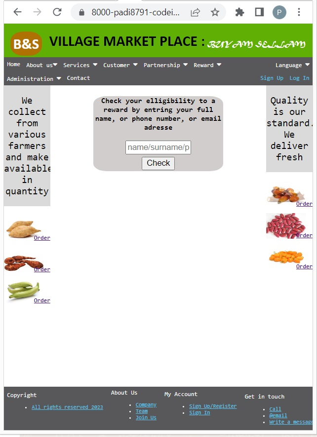

# WELCOME TO THE LOTO DRAW OF THE VILLAGE  MARKET PLACE 

In our previous project we have set the pillars of our market village place. 
Now we are engage in the process of building its features.
And one of this features is to reward our faithful customers.
We've decided to put in place a loto draw whereby during a promotion period a list of five (5) customers  will be selected in a loto draw to win various prizes. Only elligible focustomers can participate to a draw. 
In the global project completed state the list of elligible customers is generated automatically from the database of customers based on some criterias. This will be set in later phases of the global project.
In the meantime the list of elligible customers is manually dropped on the webserver by the database administrator

## Features 
This platforms loto draw module has two (2) sections. 
 1 - There is a section for the public where they can check if they are elligible for the loto draw. 
 They can also consult the list of winners of the week.

 2 - The other section of the loto draw module is for the administrator. In a later phase of the global project, the administrator should have a login page in other to gt access to this section. 
 In this section the administrator proceeds to select the five (5) winners of the week. Normally the list of the 5 winners should automatically be stored in a file on the webserver just after the draw. But due to the retrictions not to run scripts on server side in GITPOD/GITHUB environment, this list of winners will be manually stored in a file by the administrator on the webserver.

### Existing Features

- __Navigation Bar__

  - Featured on all the pages, the full responsive navigation bar includes links to loto draw module. 
  It has two section according to the audience.
    * For the general public A "Reward" menu containing sub menu gives access to elligibility check and list of winners.
    * For the administrator an "Administration" Menu with a sub menu gives the admin the access to the loto draw.

 

- __The Check elligibility page__

  - The check elligibility page gives an interface for the general public (customers) to check if the are preseleted for the loto draw. They can enter their full name, or phone number or email.
  

  

   __The View list of winners page__

  - The view list of winners page displays in a table the list of winners of the loto draw of the current week.
  

  

     __The Generate list of loto winners page__

  - The Generate list of loto winners page provides an interface for the administrator to select the five(5) winners of the loto draw of the current week.
  A customer can't be selected twice. 
  A customer can appear several times in the list of elligible customers.
  When a customer is selected, his name and phone number is displayed.
  

  

### Features Left to be Implemented

- Automatically generate the list of elligible customers from the customers database
- Automatically save the list of winners on the webserver

## Testing 

All pages were thouroughly tested thoughout the coding process. Each time a small module was added in the code, it was tested on browsers such as Chrome, Opera and IE in order to ensure compatibility.

After testing all the HTML pages locally, the HTML, CSS and javascript codes were also tested on validators such as W3C validator for HTML and Jigsaw validator.

### Local Testing
   
   - __Computer browsers__

        

        

        

     
     When strechting the window of the browser. 

        

   - __Mobile phone browsers__

        

### Validator Testing 

- __HTML__

  - No errors were returned when passing through the official W3C validator. I tested by pasting the entire html code of each page directly.
  
        

- __CSS__

  - No errors were found when passing through the official Jigsaw validator. I tested by pasting the entire CSS code directly.

        

  
  - __Javascript__

  - No major errors were found when passing through the https://jshint.com/ validator. 

        

### Unfixed Bugs

Critical bugs have been fixed sor far on the existing pages. However we still have some styling to perform on the table list when displaying the list of wnners.

## Deployment

- The loto draw module pages was deployed to GitHub pages. 
  - In the project 1 we had already deployed the website.
  In this project we are using the same website.
  Therefore we are just pushing the Loto draw module pages to GITHUB using thegit push command. 

  - All the pages were push from Gitpod which is currently our main HTML/CSS javascript editor

The live link can be found here - https://padi8791.github.io/CodeInsttute-Project1-HTML-CSS/ 

## Credits 

### Content 

- Instructions on how to implement form validation on the Sign Up page was taken from [W3Schools tutorial](https://www.w3schools.com/html/default.asp)
- The icons in the menu were taken from [Font Awesome](https://fontawesome.com/)

